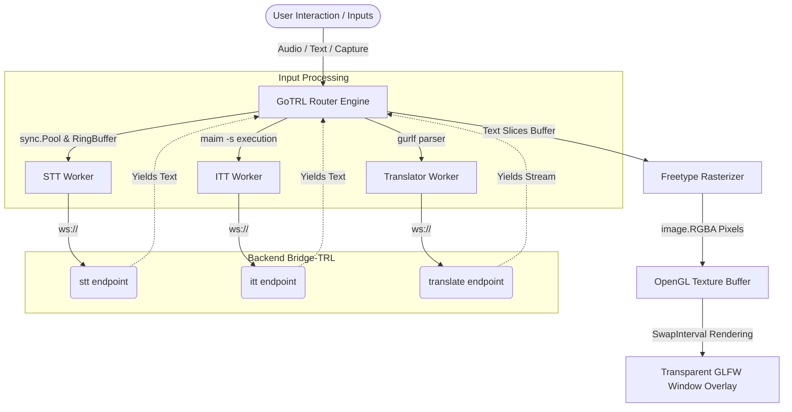

# 🚀 GoTRL

<p align="center">
  <a href="https://go.dev"></a>
  
  
  
  <a href="https://opensource.org/licenses/MIT"></a>
</p>

**GoTRL** is a high-performance, real-time routing engine and desktop overlay tool designed for seamless streaming of speech, text, and images to AI processing workers (such as [Bridge-TRL](https://github.com/Votline/Bridge-TRL)). 

Acting as the core client-side router, GoTRL captures various inputs (microphone, screenshots via desktop utils, raw strings), distributes them to active WebSocket-based backend modules, and renders the processed results directly onto a hardware-accelerated, transparent desktop overlay window.

## ✨ Key Features

* **Hardware-Accelerated Overlay**: Built natively using **OpenGL 4.1** and **GLFW**, rendering smooth text updates over a transparent, fixed-size (`400x250`) click-through frame buffer.
* **Zero-Allocation Hotpath**: Utilizes `sync.Pool` allocations for audio frames and byte buffers, raw string conversion via `unsafe`, and lock-free atomic ring buffers (`RingBuffer[T]`) for intra-worker data pipes.
* **Gurlf Configuration Format**: Powered by the custom, memory-optimized `Gurlf` configuration language, allowing ultra-fast parsing directly from files or raw inline strings with zero unnecessary heap overhead.
* **Modular Multi-Streaming**: Concurrently orchestrates standard input/output streams into decoupled components: Speech-to-Text (STT), Machine Translation, Text-to-Speech (TTS), Image-to-Text (ITT), and Grammatical Inflection.
* **Asynchronous GUI Layout Engine**: Custom font rendering system powered by `golang/freetype` that computes texture metrics on-the-fly and implements responsive line wrapping and manual UI scrolling mechanisms.

## 🏗 Architecture & Data Flow

GoTRL acts as a multi-threaded pipelines orchestrator. Input providers capture raw streams, pipe them into lock-free internal ring buffers, while concurrent workers manage continuous full-duplex WebSocket connections to backend nodes.



## ⚙️ Configuration & Formats

GoTRL supports versatile setup schemas using the high-performance **Gurlf** data layout format.

### 1. Structure Sample (`config.gurlf`)

```ini
[gotrl]
TranslatorURL:ws://localhost:8080/translate
SpeechToTextURL:ws://localhost:8080/stt
TextToSpeechURL:ws://localhost:8080/tts
InflectorURL:ws://localhost:8080/inflector
ImageToTextURL:ws://localhost:8080/itt
[\gotrl]

```

## 🚀 Usage Guide

You can launch GoTRL utilizing structural configuration files, plain inline string schemas, or via command-line runtime options.

```bash
# Way 1: Parse from a local .gurlf file
gotrl ./config.gurlf [args]

# Way 2: Inject inline config string block directly
gotrl "[gotrl]ImageToTextURL:ws://127.0.0.1:8080/itt[\gotrl]" --ui

# Way 3: Explicitly define target backend addresses via runtime flags
gotrl -trl=ws://localhost:8080/translate -stt=ws://localhost:8080/stt -inf=ws://localhost:8080/inflector -tts=ws://localhost:8080/tts -itt==ws://localhost:8080/itt

```

### Settings & Arguments Reference

```text
Settings (Flags):
    -trl   Translate:   Target WebSocket URL for Machine Translation module
    -stt   STT:         Target WebSocket URL for Speech-to-Text module
    -tts   TTS:         Target WebSocket URL for Text-to-Speech module
    -inf   Inflector:   Target WebSocket URL for Grammatical Adjustment
    -itt   ITT:         Target WebSocket URL for Image OCR module

Args:
    -d, --debug        Toggles verbose internal debug logging (Zap)
    -ui, --ui          Forces initializing the hardware-accelerated GLFW overlay interface

```

## 📜 Licenses & Dependencies

This project links against several open-source libraries to support high-performance graphic rendering, system hooks, and data streaming. Below is the compliance breakdown mapping of the files stored within the local `./licenses/` directory.

| Dependency / Module | License | Used For | Reference Link |
| --- | --- | --- | --- |
| **go-gl/glfw** | BSD-3-Clause | Cross-platform window context generation, OS window flags, and mouse/keyboard hooks. | [go-gl/glfw](https://github.com/go-gl/glfw) |
| **go-gl/gl** | MIT | Core modern OpenGL v4.1 bindings used for hardware-accelerated text and blend quad layout mapping. | [go-gl/gl](https://github.com/go-gl/gl) |
| **golang/freetype** | GPLv2 / FTL | Vector rasterization interface converting TrueType vector shapes into raw pixel matrices. | [golang/freetype](https://github.com/golang/freetype) |
| **Gorilla WebSocket** | BSD-2-Clause | Asynchronous transport frame engine layer handling streaming connections to processing blocks. | [gorilla/websocket](https://github.com/gorilla/websocket) |
| **JetBrains Mono** | OFL-1.1 | High-legibility monospaced typeface font integrated internally inside UI views. | [JetBrains/JetBrainsMono](https://github.com/JetBrains/JetBrainsMono) |
| **Go-Audio** | MIT | Direct manipulation, structural data conversion, and handling of audio byte sample sequences. | [Votline/Go-audio](https://github.com/Votline/Go-audio) |
| **Gurlf** | MIT | Ultra-fast, allocation-free configuration scanning and validation lexical parsing library. | [Votline/Gurlf](https://github.com/Votline/Gurlf) |
| **golang.org/x/image** | BSD-3-Clause | Fallback vector types, advanced font metrics descriptors, and graphics properties definitions. | [golang/image](https://golang.org/x/image) |

  - **License:** This project is licensed under [MIT](LICENSE)
  - **Third-party Licenses:** Third-party [licenses/](licenses/).
